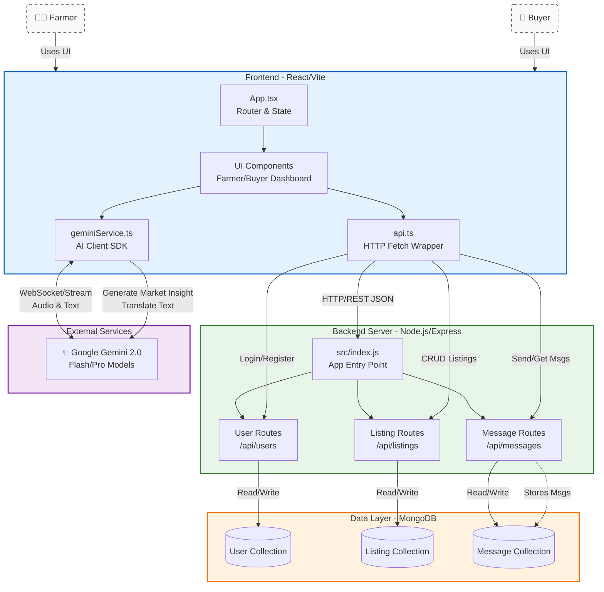

## Project Setup

This project is organized into two separate directories:
- `frontend/`: React application (Vite)
- `backend/`: Node.js/Express server

### Prerequisites

- Node.js (v18+ recommended)
- MongoDB (Local or Atlas URI)

### Installation

1.  **Frontend Setup**
    ```bash
    cd frontend
    npm install
    ```

2.  **Backend Setup**
    ```bash
    cd backend
    npm install
    ```

### Environment Configuration

Both the `frontend` and `backend` directories have their own `.env` configuration.

**Frontend (`frontend/.env`)**:
```env
GEMINI_API_KEY=your_gemini_api_key_here
```

**Backend (`backend/.env`)**:
```env
PORT=5000
MONGO_URI=your_mongodb_connection_string
```

### Running the Application

You need to run both the backend and frontend terminals.

**1. Start the Backend Server**

Open a terminal and navigate to the `backend` directory:
```bash
cd backend
npm run dev
```
The server will start on `http://localhost:5000`.

**2. Start the Frontend**

Open a new terminal and navigate to the `frontend` directory:
```bash
cd frontend
npm run dev
```
The frontend will start on the URL provided by Vite (typically `http://localhost:5173`).


# Key Features

## 🎙️ Intelligent Voice Assistant (Gemini Live)
The platform features a deeply integrated, real-time voice assistant powered by **Google Gemini 2.0 Flash**. It supports **multilingual** interaction (English & Regional Languages) and provides specialized tools for each user role:

### For Buyers 🛒
*   **Advanced Market Search**: 
    *   Filter by **Location** (e.g., *"Show me wheat available in Punjab"*).
    *   Filter by **Price Range** (e.g., *"Crops under ₹50/kg"*).
    *   Filter by **Freshness/Time** (e.g., *"Show listings added today"* or *"Newest first"*).
    *   Search by **Farmer Name** or **Crop Name**.
*   **Negotiation Aide**: The assistant acts as a translator and mediator. It can **read message history** summary and **send replies** via voice.
*   **Smart Sorting**: Sort the marketplace by price (Low-to-High or High-to-Low) instantly.

### For Farmers 🧑‍🌾
*   **Hands-Free Inventory Management**: 
    *   **Create Listings**: *"Post 100kg of Potatoes at ₹25 per kg in Nashik"*
    *   **Update Stock**: *"Change the price of Onions to ₹30"*
    *   **Delete Listings**: *"Remove my Tomato listing"*
*   **Voice Inbox**: Ask *"Do I have any new messages?"* or *"Read the last message from the buyer"*.
*   **Instant Replies**: Dictate replies to buyers without typing.
*   **Market Insights**: Get AI-generated price recommendations and trend analysis before listing.

## 🌐 Multilingual & Accessible
*   **Real-time Chat Translation**: Messages are automatically translated between the Farmer's and Buyer's preferred languages.
*   **Audio-First Interface**: Designed for accessibility, allowing full platform control through voice commands.

## ✨ Premium UI/UX Experience
*   **Immersive Dark Mode** 🌙:
    *   Full dark theme support across all dashboards and components.
    *   **Circular Reveal Animation**: A cinematic, expanding circle effect when toggling themes.
    *   System preference detection with persistent settings.
*   **Visual Delight**:
    *   **Glassmorphism**: Modern, translucent UI elements with blur effects.
    *   **Micro-interactions**: Hover lifts, glow effects, and smooth button presses.
    *   **Dynamic Transitions**: Seamless color morphing for a polished feel.

## 🔒 Enterprise Security
*   **DDoS Protection**: Integrated `express-rate-limit` prevents brute-forcing and bot swarms.
*   **NoSQL Defense**: `express-mongo-sanitize` proactively scrubs incoming objects to stop injection attacks.
*   **Header Armor**: `helmet` guards against XSS, clickjacking, and MIME-sniffing exploits.
*   **Payload Limits**: Strict 50kb caps on JSON body parsers prevent remote memory-exhaustion (DOS) attacks.


# System Architecture: SpeakHarvest

This document provides a high-level overview of the system architecture for specific use by the hackathon organization team and developers.

## System Overview

**SpeakHarvest** is a web-based platform bridging Farmers and Buyers. It uses a modern **React** frontend for the user interface, a **Node.js/Express** backend for business logic, **MongoDB** for data persistence, and **Google Gemini AI** for real-time translation and market insights.



## Key Components

### 1. Client (Frontend)
- **Framework**: React 19 with Vite.
- **Language**: TypeScript.
- **Key Files**:
    - `src/App.tsx`: Main application controller handling routing (Language -> Role -> Auth -> Dashboard).
    - `src/api.ts`: Centralizes all backend API calls (Login, Listings, Messages).
    - `src/services/geminiService.ts`: Checkpoints for Google GenAI integration (Market insights, Translation, Live Audio).

### 2. Backend (Server)
- **Runtime**: Node.js.
- **Framework**: Express.js.
- **Main Entry**: `backend/src/index.js`.
- **API Routes**:
    - `POST /api/users/login`: Handles user authentication and creation.
    - `GET/POST /api/listings`: Manages crop listings (CRUD).
    - `GET/POST /api/messages`: Handles inter-user messaging.

### 3. Database
- **System**: MongoDB (via Mongoose ODM).
- **Collections**:
    - `users`: Stores profile info (Phone, Role, Language).
    - `listings`: Stores crop details linked to farmers.
    - `messages`: Stores chat history between users.

### 4. Artificial Intelligence
- **Provider**: Google Gemini API.
- **Integration**: Direct Client-Side integration (Low latency).
    - Real-time Audio Streaming (Gemini Live).
    - Structured Market Data Generation (JSON Mode).
    - Multi-modal interaction.

## Contributors

We welcome contributions! A special thanks to all the developers who have helped build and improve SpeakHarvest:

*   **Urmil** - *Frontend Enhancements & UI Polish*  *(Or insert your preferred name here)*


